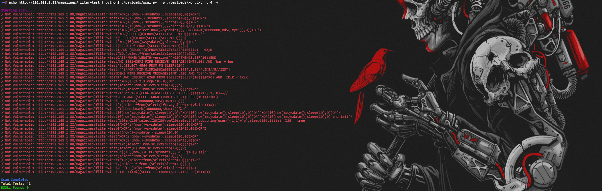

# WSQL: Vulnerability Validation SQL Injection | Blind SQL Injection Scanner

[](https://github.com/hunthack3r/wsql/blob/main/LICENSE) 
[](https://github.com/hunthack3r/wsql/issues)
[](https://github.com/hunthack3r/wsql/stargazers)

**WSQL** is a high-performance, multithreaded Blind SQL Injection scanner designed to identify SQL vulnerabilities efficiently and with precision. Using customized payloads and random user agents, WSQL can assist in finding critical security flaws in your web applications.

## Features

- 🔍 **Blind SQL Injection Detection**: Specifically designed to detect blind SQL injection vulnerabilities in web applications.
- ⚡ **Multithreaded Scanning**: Efficient scanning with multithreading capabilities to speed up vulnerability detection.
- 🎯 **Payload Flexibility**: Use any custom payloads to perform targeted injection tests.
- 🕵️‍♂️ **Randomized User Agents**: Avoid detection by using randomized user-agent strings for each request.
- 🛠️ **Verbose Mode**: Detailed output to get more insight into the scanning process.
- 📝 **Save Results**: Store all vulnerable URLs found during the scan in a file for future reference.

## Installation

To install WSQL, you need to have Python 3.x installed on your machine along with some dependencies:

```bash
cd /opt
git clone https://github.com/hunthack3r/wsql
cd wsql
pip install -r requirements.txt
```
Automatic usage 
```
alias wsql='python3 /opt/wsql/wsql.py -p /opt/wsql/all.txt'
```
Automatic usage example after the `alias`
```
echo 'https://www.softeal.com/integration/Positions.asmx?op=CurrentPositionsQuery' | wsql
```

# OR 

## Usage


Once installed, you can start using WSQL to scan URLs for SQL injection vulnerabilities by passing a URL through `stdin` and specifying the payload file.

### Basic Usage

```bash
echo https://example.com | python3 custom.py -p xor.txt -t 4 -v
```

### Command-Line Options:

- `-p` : Path to the payload file containing injection strings.
- `-t` : Number of concurrent threads to use (default is 0).
- `-v` : Enable verbose output to show detailed information about the scan.
- `-c` : (Optional) Add a cookie for authenticated requests.

### Example:

```bash
echo https://example.com/magazines?filter=test | python3 custom.py -p xor.txt -t 4 -v
```

This command scans the specified URL for SQL injection vulnerabilities using the payloads provided in `xor.txt` with 4 concurrent threads and verbose mode enabled.



### Save Vulnerable URLs:

You can save the found vulnerable URLs to a file using the prompt that appears at the end of the scan.

```bash
Enter the filename to save the list of vulnerable URLs: vuln_urls.txt
```

## Contributing

We welcome contributions! Feel free to fork the project, submit issues, or create pull requests to improve the tool. 

1. Fork the repository.
2. Create a feature branch (`git checkout -b feature/YourFeature`).
3. Commit your changes (`git commit -m 'Add some feature'`).
4. Push to the branch (`git push origin feature/YourFeature`).
5. Open a pull request.

## License

This project is licensed under the MIT License. See the [LICENSE](https://github.com/hunthack3r/wsql/blob/main/LICENSE) file for details.

## Keywords and Tags:

- Blind SQL Injection Scanner
- SQLi Detection
- SQL Injection Vulnerability Tool
- Web Application Security
- Penetration Testing
- Payload-based Injection Scanner
- Cybersecurity Tool
- Automated SQL Injection Scanner
- SQLi Scanner
- SQL Vulnerability Detection
- BSQL Scanner
- Security Testing
- Ethical Hacking

## Support

Feel free to [open an issue](https://github.com/hunthack3r/wsql/issues) for bug reports or feature requests. For more information, check the [documentation](https://github.com/hunthack3r/wsql/wiki).

---

Don't forget to **Star** ⭐ this repository if you find WSQL helpful! It motivates us to continue improving this project. 

Stay secure, and happy hacking! 🛡️
